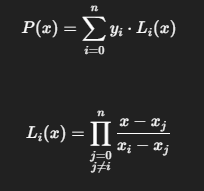

Investigacion Teorica - Tema 2 

La interpolación es una técnica para estimar valores intermedios de una función a partir de un conjunto de puntos conocidos. El método de interpolación de Lagrange utiliza polinomios para aproximar la función y calcular valores no tabulados.

Formula

Ventajas:

    Muy útil para tablas de datos.

    No requiere derivadas ni condiciones iniciales.

Desventajas:

    Si los puntos están mal distribuidos (espaciado irregular), puede haber oscilaciones grandes (fenómeno de Runge).

    No sirve para extrapolar (fuera del intervalo).

    Requiere todos los 𝑥 ,𝑖 distintos.