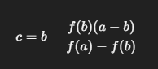

#Investigacion Teorica - Tema 2 

También conocido como método de la falsa posición, es una técnica para encontrar raíces de funciones continuas. A diferencia del método de bisección, utiliza una interpolación lineal entre los puntos extremos del intervalo para estimar la raíz, lo que puede conducir a una convergencia más rápida en ciertos casos.

Formula: 

Ventajas:

    Más rápida que la bisección (en muchos casos).

    También garantiza convergencia si hay cambio de signo.

Desventajas:

    Puede volverse lenta si uno de los extremos queda fijo mucho tiempo.
