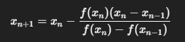

#Investigacion Teorica - Tema 2 

Usa una línea secante entre dos puntos cercanos para aproximar la raíz sin necesidad de derivadas yE l método de la secante es un método abierto para encontrar raíces. Es una mejora del método de Newton-Raphson, pero sin requerir derivadas.

Formula

Ventajas:

    Más rápido que la bisección y regla falsa (convergencia superlineal).

    No necesita derivada.

Desventajas:

    No siempre converge.

    Requiere dos valores iniciales razonables.  