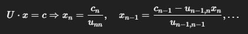

#Investigacion Teorica - Tema 3

La Eliminación Gaussiana es un método directo que transforma un sistema de ecuaciones lineales en una forma escalonada superior mediante operaciones elementales sobre las filas. Una vez que se obtiene esta forma, se resuelve el sistema por sustitución regresiva.

Formula:

Ventajas:

    Método exacto (sin errores iterativos).

    Útil para sistemas pequeños a medianos.

    Base para otros métodos como Gauss-Jordan y LU.

Desventajas:

    No apto para matrices mal condicionadas o singulares.

    No escalable para sistemas muy grandes.

    Susceptible a errores de redondeo si no se usa pivoteo.