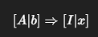

#Investigacion Teorica - Tema 2 

El método de bisección es una técnica numérica para encontrar raíces de funciones continuas. Se basa en el Teorema de Bolzano, que establece que si una función continua cambia de signo en un intervalo [a, b], entonces existe al menos una raíz en ese intervalo. El método consiste en dividir el intervalo en dos partes y seleccionar la subparte donde ocurre el cambio de signo, repitiendo este proceso hasta alcanzar una aproximación deseada de la raíz.

Formula 

Ventajas:

    Siempre converge si 𝑓 es continua y hay cambio de signo.

    Simple y robusto.

Desventajas:

    Convergencia lenta (lineal).

    Solo funciona si hay cambio de signo.