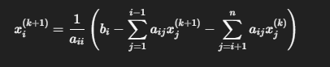

#Investigacion Teorica - Tema 3

Otro método iterativo, pero a diferencia de Jacobi, Gauss-Seidel usa los nuevos valores tan pronto como se calculan, acelerando la convergencia.

Formula 

Ventajas:
    Converge más rápido que Jacobi.

    Útil para matrices dispersas y problemas de ingeniería.

Desventajas:
    También requiere matrices diagonalmente dominantes o simétricas positivas definidas.

    No paralelizable tan fácilmente como Jacobi.

    A veces puede oscilar y no converger.