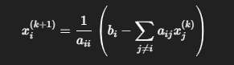

#Investigacion Teorica - Tema 3

Es un método iterativo para resolver sistemas lineales. Calcula el valor de cada variable usando solo los valores de la iteración anterior. Funciona mejor si la matriz es diagonal dominante.

Formula 

Ventajas:
    Fácil de implementar.

    Paralelizable (cada variable se puede calcular de forma independiente).

    Útil en sistemas grandes y dispersos.

Desventajas:
    Requiere muchas iteraciones.

    No siempre converge (requiere matriz diagonal dominante o estrictamente dominante).

    Sensible a los valores iniciales.