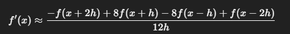

#Investigacion Teorica - Tema 4

La fórmula de cinco puntos es un método de diferenciación numérica que permite obtener una mejor aproximación de la derivada de una función usando cinco puntos equidistantes. Es más precisa que la fórmula de tres puntos porque incluye más términos de la serie de Taylor, lo cual reduce el error truncado.

Formulas:

Para derivada primera centrada 

Ventajas

    Alta precisión (error de orden 𝑂(ℎ4)).

    No requiere derivadas simbólicas.

    Funciona bien en funciones suaves.

Desventajas
    Necesita más evaluaciones de la función (5 puntos).

    No se puede usar en extremos (requiere dos puntos hacia adelante y hacia atrás).

    Puede fallar si la función tiene ruido o no es suave.