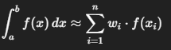

#Investigacion Teorica - Tema 4

La cuadratura gaussiana es un método numérico avanzado para calcular integrales definidas. Su principal característica es que selecciona los puntos de evaluación (nodos) y sus pesos (pesos de Gauss) de forma que se maximiza la precisión para una cantidad fija de evaluaciones.

Formula:

Ventajas
    Precisión muy alta con pocos puntos.

    Excelente para funciones suaves.

Desventajas
    No sirve bien con funciones con discontinuidades o comportamientos irregulares.

    Los nodos y pesos deben calcularse o extraerse de tablas.

