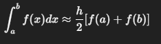
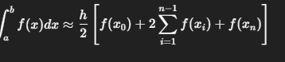

#Investigacion Teorica - Tema 4

El método del trapecio es una técnica de integración numérica que aproxima el área bajo una curva 𝑓(𝑥)
 entre dos puntos usando el área de un trapecio. Es una de las formas más simples de cuadratura numérica.

Formula:
    Para un solo intervalo:

Para múltiples subintervalos (regla compuesta):

Ventajas
    Fácil de implementar.

    Útil cuando se tienen pocos datos.

    Funciona bien para funciones suaves.

Desventajas
    Baja precisión para funciones muy curvas.

    Error de orden 𝑂(ℎ^2)

    Puede ser ineficaz si se usa con intervalos grandes.