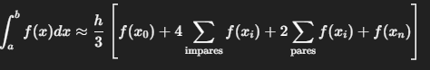

#Investigacion Teorica - Tema 4

La Regla de Simpson es un método de integración numérica que aproxima el área bajo una curva usando parábolas en lugar de segmentos rectos. Proporciona una mejor aproximación que el método del trapecio.

Formula:
    Simpson 1/3 (para un número par de subintervalos):

  

Ventajas
    Mucho más preciso que el método del trapecio con la misma cantidad de puntos.

    Error de orden 𝑂(ℎ4).

    Muy eficaz para funciones suaves.

 Desventajas
 
    Solo funciona con un número par de intervalos.

    Más costoso computacionalmente que el trapecio.

