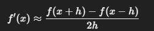
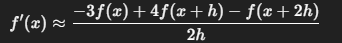
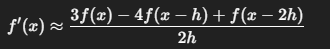

#Investigacion Teorica - Tema 4

La fórmula de tres puntos es una técnica de diferenciación numérica que utiliza tres puntos equidistantes para aproximar la derivada de una función en un punto específico. Dependiendo de la posición del punto de interés, se puede utilizar la fórmula hacia adelante, hacia atrás o centrada..

Formulas:
    Diferencia centrada (mayor precisión):
        

    Diferencia hacia adelante:
    
        

    Diferencia hacia atras:
        

Ventajas

    Sencillez en la implementación.

    Buena precisión para funciones suaves.

    Requiere pocos puntos de evaluación.

Desventajas

    Menor precisión en comparación con métodos de más puntos.

    Sensible al ruido en los datos.

    Requiere que los puntos estén equidistantes.