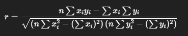

#Investigacion Teorica - Tema 4

La correlación mide la fuerza y la dirección de una relación lineal entre dos variables cuantitativas. Se expresa mediante el coeficiente de correlación de Pearson 𝑟, que toma valores entre −1 y 1:

Formula:
    

Ventajas

Es una medida simple y rápida para evaluar relaciones lineales.

Ayuda a decidir si es válido aplicar regresión lineal.

Es un valor estandarizado, fácil de interpretar.

Desventajas

Solo mide correlación lineal; no detecta relaciones no lineales.

No implica causalidad, solo asociación.

Sensible a valores atípicos.
