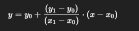

#Investigacion Teorica - Tema 5

La interpolación lineal es una técnica que utiliza rectas entre dos puntos consecutivos conocidos para estimar valores intermedios. Se asume que entre dos puntos, la función varía linealmente.

Formula:
    Simpson 1/3 (para un número par de subintervalos):

Ventajas

    Simple y rápida.

    Útil cuando se tienen pocos datos.

    No requiere operaciones complejas.

Desventajas

    No es precisa si la función no es aproximadamente lineal entre los puntos.

    No es suave ni continua en derivadas.

