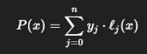

#Investigacion Teorica - Tema 5
La Interpolación Polinómica busca encontrar un polinomio de grado 𝑛  que pase exactamente por 𝑛+1 puntos dados. Es útil cuando se desea una función suave que pase por todos los puntos conocidos.

Formula:
    

Ventajas

    Pasa exactamente por todos los puntos dados.

    Útil para funciones suaves y continuas.

Desventajas

    Puede presentar oscilaciones significativas (fenómeno de Runge) si se utilizan muchos puntos o si están desigualmente espaciados.

    Requiere recalcular todo el polinomio si se añade un nuevo punto.
