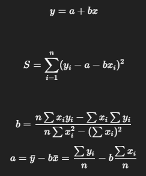

#Investigacion Teorica - Tema 5

El método de mínimos cuadrados es una técnica para ajustar un modelo (generalmente lineal) a un conjunto de datos minimizando la suma de los cuadrados de las diferencias entre los valores observados y los valores predichos por el modelo.

Formula:
    

Ventajas
    Fácil de implementar y comprender.

    Da un modelo aproximado que minimiza errores en sentido cuadrático.

    Funciona bien cuando los errores son aleatorios y normalmente distribuidos.

Desventajas
    Sensible a valores atípicos (outliers).

    Solo ajusta bien cuando la relación es lineal o el modelo elegido es adecuado.

    No garantiza un buen ajuste si los datos tienen tendencia no lineal y no se transforma el modelo.