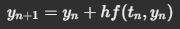

#Investigacion Teorica - Tema 6

Los métodos de un paso son técnicas numéricas para resolver ecuaciones diferenciales ordinarias (EDO) que utilizan exclusivamente la información del punto actual para calcular el siguiente valor.

Formula:
    

Ventajas

Fácil de implementar.

Bajo costo computacional.

Desventajas

Poca precisión.

Error acumulativo.
