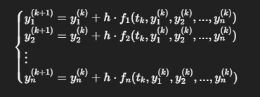

#Investigacion Teorica - Tema 6

El Método de Euler es una técnica numérica de primer orden utilizada para aproximar soluciones de ecuaciones diferenciales ordinarias (EDO). Cuando se aplica a sistemas de EDO, el método se extiende para manejar múltiples ecuaciones simultáneamente.

Formula:
Dado un sistema de EDO de la forma:

    

Ventajas
Simplicidad: Fácil de entender e implementar.

Computacionalmente eficiente: Requiere menos recursos computacionales.

Adecuado para problemas con soluciones suaves: Funciona bien cuando las soluciones no presentan comportamientos abruptos.

Desventajas
Precisión limitada: Puede ser inexacto si se utilizan pasos grandes.

Estabilidad: No es adecuado para sistemas rígidos o con soluciones oscilatorias.

Error acumulativo: Los errores pueden acumularse rápidamente con cada paso.
